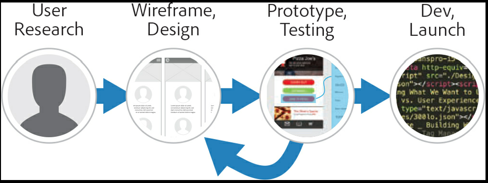

# Adobe XD Notes

In a typical web or app design workflow today, we follow the general process shown in the following figure:

Your design process may be different, depending on the project scope, budget, size, and type, but this is generally how
the process works.

First, we gather information through research. You can ask questions of clients and your potential target audience, work
with focus groups, check existing analytics, and more. We then start a design. Your designs can a hand-drawn sketch--also
called a low fidelity wireframe--or a fully designed, high-fidelity design. Early in the days of the mobile web, we would
sketch, wireframe, and design. Today, we typically design, prototype, and collaborate (share).

To test the user experience, we create an interactive prototype at some point in the design process. A prototype is a tool
for gathering feedback on the feasibility and usability of our designs.

###### Adobe XD and Retina (HiDPI)
By default, artboards in Adobe XD are considered 1x, or non-Retina (non-HiDPI) in size. If you want to design at 2x, or
Retina sizing, (HiDPI), you will need to create custom artboards that are twice the size (scale) of the default artboards.
For instance, by default the iPhone 6, 7, 8 artboard size in Adobe XD is 375 x 667. To design at Retina (HiDPI) size, you
need to change the artboard dimensions to 750 x 1334.

Raster content you import will need to be of sufficient pixel density. When you export content, you can change the Designed
At option to get the correct export sizes, whether you designed at 1x or 2x (Retina).

###### Artboards and responsive layouts
When designing for multi-device landscape today, it's important to consider the wide variety of screen sizes available
across mobile, tablet, and desktop resolutions. Since not all designers use similar devices, designers need to consider
how content works across multiple screen sizes.

To solve this user problem, Adobe XD has developed a feature, called responsive resize, that allows you to resize objects
while maintaining spatial relationships at different sizes to best adapt to multiple screen sizes.

##### Adding grids and guides to artboards
In Adobe XD, there is a universal pixel grid that you can snap content to. In addition, there are several ways to position
and lay out with precision: square grids, layout grids, and artboard guides.

Note: AdobeXD uses a virtual pixel for most of its measurements and font sizes, which is the same unit of measurement as
a CSS pixel, the basic unit of measurement in iOS. The virtual pixel is roughly equal to one physical pixel on a 72 dpi
monitor (and is equal to 1 point). You cannot change the unit of measurement in Adobe XD.

Square grids provide horizontal and vertical guides that you can align content to. When you draw or transform content,
objects snap to the grid automatically when the edges of the object are within the grid's snap-to zone. Square grids
can be useful for aligning objects and also for giving an idea of measurement when designing, and they are most often
used when designing apps.

Layout grids can be used to define columns on each artboard. A layout grid helps you define the underlying structure of
your design and how each component in it responds to different breakpoints for responsive designs (web design).

###### Layout grid
The number and size of the columns displayed of the columns displayed in the artboard depends on the size of the artboard.
For example, a phone-sized artboard has fewer and narrower columns than does the default layout grid for a desktop artboard.
If you resize an artboard, the column widths in the layout grid change to fit the new artboard size. You can change grid
properties depending on your design needs.
