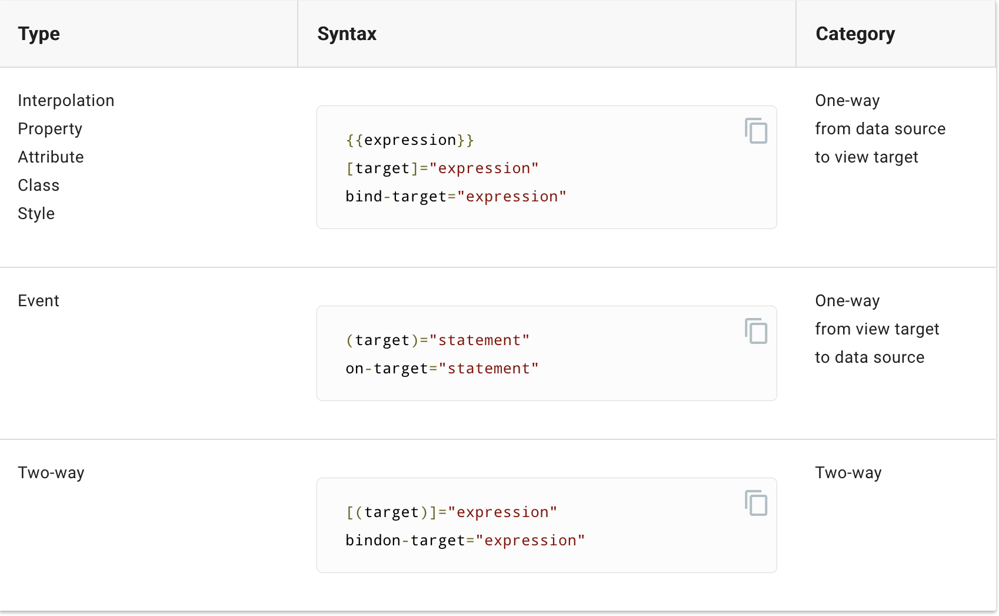
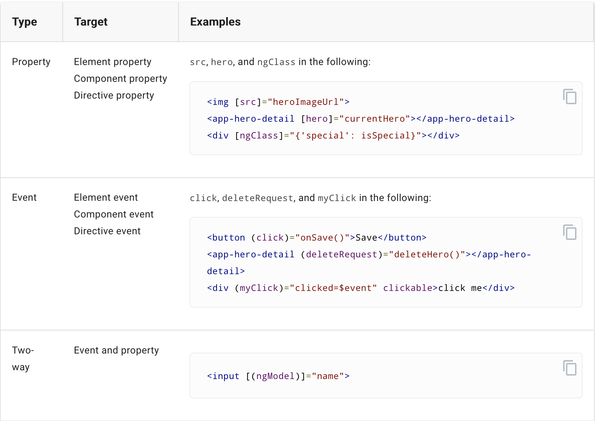
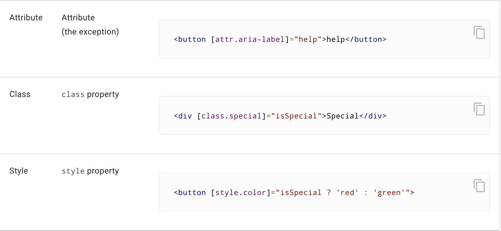
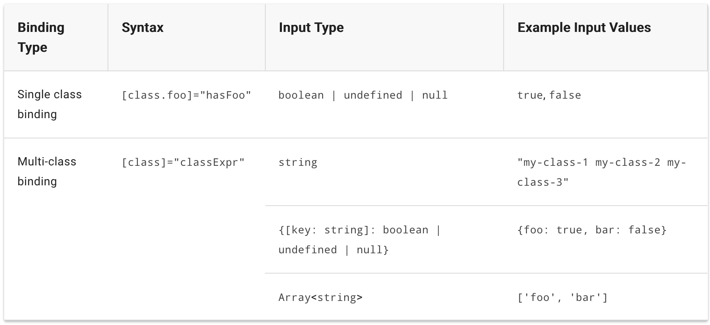
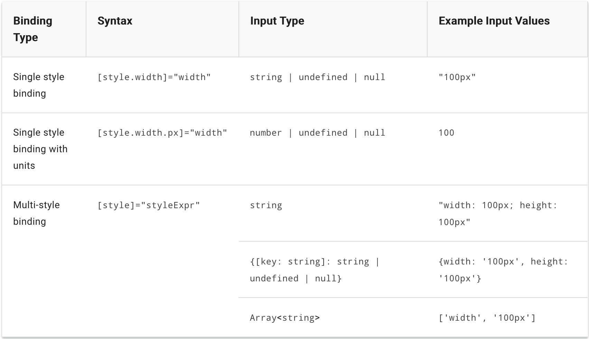

# Angular Notes

## Angular Concepts
The architecture of an Angular application relies on certain fundamental concepts. The basic building
blocks are *NgModules*, which provide compilation context for *components*. NgModules collect related
code into functional sets, an Angular app is defined by a set of NgModules. An app always has at least
a *root module* that enables bootstrapping, and typically has many more *feature modules*.

* Components define *views*, which are sets of screen elements that Angular can choose among and modify
  according to your program logic and data.
* Components use *services*, which provide specific functionality not directly related to views. Service
  providers can be *injected* into components as *dependencies*, making your code modular, reusable, and
  efficient.
  
Both components and services are simply classes, with *decorators* that mark their type and provide metadata
that tells Angular how to use them.

## Components & Templates

### Displaying Data

* Choosing the template source
  * By default, the angular CLI command `ng g c` generates components with a template file. You can override that by
    adding the `-t` option
    
### Template Syntax

#### HTML in templates
The `<script>` element is forbidden, eliminating the risk of script injection attacks. In practice, `<script>` is ignored
and a warning appears on the console.

#### Binding syntax: an overview



Every public member of a **source** directive is automatically
available for binding.

##### Data-binding and HTML
Data binding works with *properties* of DOM elements, components, and directives, not HTML *attributes*.

##### HTML attribute vs DOM property
**Attributes are defined by HTML. Properties are accessed from DOM nodes.**
* A few HTML attributes have 1:1 mapping to properties, for example `id`.
* Some HTML attributes don't have corresponding properties, for example, `aria-*`.
* Some DOM properties don't have corresponding attributes, for example `textContent`

In Angular, the only role of HTML attributes is to initialize element and directive state.
**Template binding works with _properties_ and _events_, not _attributes_**.

#### Binding types and targets



#### Attribute, class and style bindings
##### Attribute binding
Set the value of an attribute directly with an attribute binding. This is the only exception to the rule that
a binding sets a target property and the only binding that creates and sets an attribute.

Attribute binding syntax resembles property binding, but instead of an element property between brackets, start with
the prefix `attr`, followed by a dot `.` and the name of the attribute. You then set the attribute value, using an
expression that resolves to a string, or remove the attribute when the expression resolves to `null`.

##### Class binding
You can also add and remove CSS class names from an element's `class` attribute with a **class binding**.


##### Style binding


##### Style precedence
The more specific a class or style binding is, the higher its precedence. A binding to a specific class ex `[class.foo]`
will take precedence over a generic `[class]` binding, same with style. Directive host bindings are considered less
specific because directives can be used in multiple locations, so they have a lower precedence than template bindings.
In addition, bindings take precedence over static attributes.

##### Delegating to styles with lower precedence
It is possible for higher precedence styles to 'delegate' to lower precedence styles using `undefined` values. Whereas
setting a style property to `null` ensures the style is removed, setting it to `undefined` will cause Angular to fall
back to the next-highest precedence binding to that style.

#### Event binding `(event)`
Event binding allows you to listen for certain events such as keystrokes, mouse movements, clicks, and touches.

##### Target event
ex: `<button (click)="onSave($event)>Save</button>` or `<button on-click="onSave($event)"></button`

##### $event and event handling statements
The target event determines the shape of the $event object. If the target event is a native DOM element event, then
$event is a DOM event object, with properties such as `target` and `target.value`.

#### Two Way binding `[(...)]`
Two-way binding gives your app a way to share data between a component and its template.

##### Basics of two-way binding
2-way binding does 2 things:
1. Sets a specific element property
2. Listens for an element change event

Angular offers a special *2-way data binding* syntax for this purpose, `[()]`. The `[()]` syntax combines the brackets
of property binding `[]`, with the parenthesis of event binding, `()`.

The `[()]` syntax is easy to demonstrate when the element has a settable property called `x` and a corresponding event
named `xChange`. Ex: `[(x)]="someValue"`. The 2-way binding syntax is really just syntactic sugar for a *property* binding
and an *event* binding.

#### Built-in structural directives

##### NgFor

###### NgFor with `index`
The `index` property of the `NgFor` directive context returns the zero-based index of the item in each iteration. You
can capture the `index` in a template input variable and use it in the template. ex: `let item of items; let i=index`

###### NgFor with `trackBy`
If you use NgFor with large lists, a small change to 1 item, such as removing or adding an item, can trigger a cascade
of DOM manipulations. For example, re-querying a server could reset a list with all new item objects, even when those
items were previously displayed. In this case, Angular sees only a fresh list of new object references and has no choice
but to replace the old DOM elements with all new DOM elements.

You can make this more efficient with `trackBy`. Add a method to the component that returns the value NgFor should track.
ex: `trackByItems(index: number, item: Item): number { return item.id; }`, and then in html `<div *ngFor="let item of items; trackBy: trackByItems">`

##### NgSwitch
NgSwitch is like the JS `switch` statement. NgSwitch is actually a set of 3, cooperating directives: NgSwitch, NgSwitchCase,
and NgSwitchDefault as in the following example. ex:

```html
<div [ngSwitch]="currentItem.feature">
  <app-stout-item *ngSwitchCase="'stout'" [item]="currentItem"></app-stout-item>
  <app-device-item *ngSwitchCase="'slim" [item]="currentItem"></app-device-item>
  <app-unknown-item *ngSwitchDefault [item]="currentItem"></app-unknown-item>
</div>
```

NgSwitch is the controller directive. Bind it to an expression that returns the *switch value* such as feature. Though
the feature value in this example is a string, the switch value can be of any type.

#### Template reference variables (`#var`)
A **template reference variable** is often a reference to a DOM element within a template. It can also refer to a directive
(which contains a component), an element, TemplateRef or a web component.

##### Template reference variable considerations
A template *reference* variable (`#phone`) is not the same as a template *input* variable (`let phone`) such as in an
`*ngFor`. The scope of a reference variable is the entire template. So, don't define the same variable name more than once
in the same template as the runtime value will be unpredicatable.

##### Alternative syntax
You can use the `ref-` prefix alternative to `#`. ex: 
```angular2html
<input ref-fax placeholder="fax number" />
<button (click)="callFax(fax.value)"></button>
```

#### `@Output()` and `@Input()`
* OnChanges and `@Input()` - to watch for changes on an `@Input()` property, use OnChanges.

#### Template expression operators

##### The safe navigation operator `(?)` and null property paths
The Angular safe navigation operator, `?`, guards against `null` and `undefined` values in property paths. 
ex: `<p>The item name is {{item?.name}}</p>`

##### The non-null assertion operator `(!)`
As of typescript 2.0, you can enforce strict null checking with the `--strictNullChecks` flag. TS then ensures that no
variable in unintentionally `null` or `undefined`. In this mode, typed variables disallow `null` and `undefined` values
by default. The type checker throws an error if you leave a variable unassigned or try to assign `null` or `undefined`
to a variable whose type disallows `null` and `undefined`. The type checker also throws an error if it can't determine
whether a variable will be `null` or `undefined` at runtime. You tell the type checker not to throw an error by applying
the postfix non-null assertion operator, `!`. ex: `<p>The item's color is {{item.color!.toUpperCase()}}</p>`

#### Built-in template functions

##### The `$any()` type cast function
Sometimes a binding expression triggers a type error during AOT compilation and it is not possible or difficult to fully
specify the type. To silence the error, you can use `$any()` cast function to cast the expression to the `any` type.
ex: `<p>The item's undeclared best by date is: {{$any(item).bestByDate}}</p>`

The `$any()` cast function also works with `this` to allow access to undeclared members of the component.

#### SVG in templates
When you use an SVG as a template, you are able to use directives and bindings just like with HTML templates. This means
that you'll be able to dynamically generate interactive graphics.

## Angular Microfrontend
* We will need a few dependencies to build and run Angular custom elements.
  * `ng add @angular/elements`
  * `ng add ngx-build-plus`

* Mapping - a custom element hosts an Angular component, providing a bridge between the data and logic
  defined in the component and standard DOM APIs. Component properties and logic maps directly into HTML
  attributes and the browser's event system.
  * the creation api parses the component looking for input properties, and defines corresponding attributes
    for the custom element. It transforms the property names to make them compatible with custom elements,
    which do not recognize case distinctions. The resulting attribute names use dash-separated lowercase.
    For example, for a component with `@Input('myInputProp') inputProp`, the corresponding custom element
    defines an attribute `my-input-prop`.
  * component outputs are dispatched as HTML Custom Events, with the name of the custom event matching the
    output name. For example, for a component with `@Output() valueChanged = new EventEmitter()`, the
    corresponding custom element will dispatch events with the name "valueChanged", and the emitted data
    will be stored on the event's `detail` property. If you provide an alias, that value is used.

Steps
1. Add component/components that you wish to create custom element to `entryComponents` list in `AppModule`
2. Remove `AppComponent` from `bootstrap` list in `AppModule`
3. Add the following to `AppModule` class
```ts
export class AppModule {
    constructor(private injector: Injector) {}  
    ngDoBootstrap() {
        const myCustomElement = createCustomElement(BookingComponent, { injector: this.injector });
        customElements.define('app-flight-booking', myCustomElement);
  }
}
```
4. To build the project in a single JS file, we need to tell angular to use *ngx-build-plus* module. Modify
the `angular.json` in 3 places as follows:
```json
"architect": {
    "build": { "builder": "ngx-build-plus:build" }
    "serve": { "builder": "ngx-build-plus:dev-server"}
    "test": { "builder": "ngx-build-plus:karma"}
}
```
5. Run the following command to build the project into a single JS file.
`ng build --prod --output-hashing none --single-bundle true`
  1. `--output-hashing none` - will avoid hashing the file names
  2. `--single-bundle true` - will bundle all compiled files into a single JS file 
6. Add dependencies and build files to another project and test it
```html 
<script src="https://cdnjs.cloudflare.com/ajax/libs/zone.js/0.9.1/zone.min.js"></script>
<script src="https://cdnjs.cloudflare.com/ajax/libs/webcomponentsjs/2.2.10/custom-elements-es5-adapter.js"></script>
<script type="text/javascript" src="http://localhost:8081/main.js"></script>
<script type="text/javascript" src="http://localhost:8082/main.js"></script>
```

## Angular Animations
### Getting Started
1. Import `BrowserAnimationsModule`
2. Import animation functions into component files
```ts
import { Component, HostBinding } from '@angular/core';
import {
  trigger,
  state,
  style,
  animate,
  transition,
  // ...
} from '@angular/animations';
```
3. Add the animation metadata property
```ts
@Component({
  selector: 'app-root',
  templateUrl: 'app.component.html',
  styleUrls: ['app.component.css'],
  animations: [
    // animation triggers go here
  ]
})
```
4. Animating a simple transition
```ts
animations: [
  trigger('openClose', [
    /*
    state(): use this function to define different states to call at the end of each transition.
    This function takes 2 arguments, a unique name like open or closed and a style() function

    style(): use this function to define a set of styles to associate with a given state name

    transition(): to make the change less abrupt, we need to define an animation transition to 
    specify the changes that occur between one state and another over a period of time. This 
    function accepts 2 arguments, the frist argument accepts an expression that defines the direction
    between two transition states, and the second argument accepts an animate() function.

    animate(): use this function to define the length, delay, and easing of a transition, and to
    desginate the style function for defining styles while transitions are taking place. You can
    also use this function to define the keyframes() for multistep animations. These definitions are
    placed in the second argument of the animate(). animate('duration delay easing')

    Some additional notes on using styles within state and transitions functions
    * Use state() to define styles that are applied at the end of each transition, they persist after
    the animation has completed.
    * Use transition() to define intermediate styles, which create the illusion of motion during the
    animation.
    * When animations are disabled, transition() styles can be skipped, but state() styles can't
    * You can include multiple state pairs within the same transition() argument 
    ex: transition('on => off, off => void')

    trigger(): an animation requires a trigger, so that it knows when to start. This function collects
    the states and transitions, and gives the animation a name, so that you can attach it to the triggering
    element in the HTML template. This function describes the property name to watch for changes. When a
    change occurs, the trigger initiates the actions included in its definition. These actions can be
    transitions or other functions.
    */
    state('open', style({
      height: '200px',
      opacity: 1,
      backgroundColor: 'yellow'
    })),
    state('closed', style({
      height: '100px',
      opacity: .5,
      backgroundColor: 'green'
    })),
    transition('open => closed', [animate('1s')]),
    transition('closed => open', [animate('0.5s')])
  ])
]
```
5. Attach trigger to element `<div [@triggerName]="expression">...</div>`. For elements entering or leaving
the a page (inserted or removed from the DOM), you can make the animations conditional. For example, use `*ngIf`
with the animation trigger in the HTML template.

## Angular CLI Builders
A number of Angular CLI commands run a complex process on your code, such as linting, building, or testing. The commands
use an internal tool called Architect, to run *CLI builders*, which apply another tool to accomplish the desired task.
With Angular 8, the CLI Builder API is stable and available to developers who want to customize the Angular CLI by adding
or modifying commands. For example, you could supply a builder to perform an entirely new task, or to change which 3rd party
tool is used by an existing command.

### CLI Builders
The internal Architect tool delegates work to handler functions called *builders*. A builder handler function receives
2 arguments, a set of input `options` (a JSON object), and a `context` (a `BuilderContext` object).

## Deployment

### Deferential Loading
