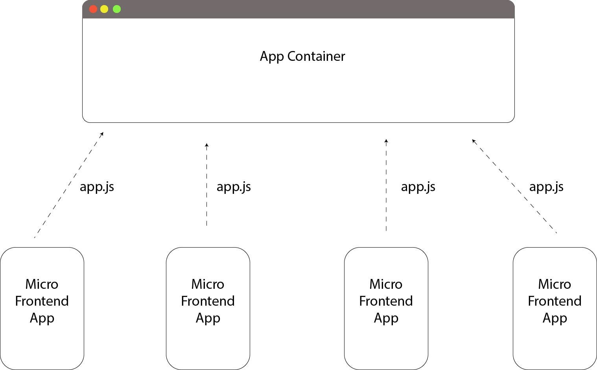

# Micro Frontend Architecture Proposal

## Ecosystem

### Container
* an application container loads application javascript bundles at runtime
* takes care of routing all app (app is a web component) rest calls to the proper
  backend
* loads dependencies of apps
  * libraries and polyfills (angular requires zonejs, customElements requires webcomponents polyfills) can be loaded at
    runtime or compile time
  * other web components can be loaded at runtime
* passes data as attributes to web components
* subscribes to events from web components

### Micro Frontend App
* app is build as a single js bundle
* app defines web components for containers to load
* app documents dependencies so the app container knows and loads
  the dependencies
  * note: **APP DOES NOT LOAD OTHER WEB COMPONENTS**


## The technicals

### Web Component
The micro frontend app defines web components using the native
`customElements` interface. You can build web components natively
or you can use an existing web framework like angular to build
your web components.

### Web Component from Angular Component

**Mapping**
* Mapping - a custom element hosts an Angular component, providing a bridge between the data and logic
  defined in the component and standard DOM APIs. Component properties and logic maps directly into HTML
  attributes and the browser's event system.
  * the creation api parses the component looking for input properties, and defines corresponding attributes
    for the custom element. It transforms the property names to make them compatible with custom elements,
    which do not recognize case distinctions. The resulting attribute names use dash-separated lowercase.
    For example, for a component with `@Input('myInputProp') inputProp`, the corresponding custom element
    defines an attribute `my-input-prop`.
  * component outputs are dispatched as HTML Custom Events, with the name of the custom event matching the
    output name. For example, for a component with `@Output() valueChanged = new EventEmitter()`, the
    corresponding custom element will dispatch events with the name "valueChanged", and the emitted data
    will be stored on the event's `detail` property. If you provide an alias, that value is used.
    
**Dependencies**
* `ng add @angular/elements`
* `ng add ngx-build-plus`


**Steps**
1. Add component/components that you wish to create custom element to `entryComponents` list in `AppModule`
2. Remove `AppComponent` from `bootstrap` list in `AppModule`
3. Add the following to `AppModule` class
```ts
export class AppModule {
    constructor(private injector: Injector) {}  
    ngDoBootstrap() {
        const myCustomElement = createCustomElement(BookingComponent, { injector: this.injector });
        customElements.define('app-flight-booking', myCustomElement);
  }
}
```
4. To build the project in a single JS file, we need to tell angular to use *ngx-build-plus* module. Modify
the `angular.json` in 3 places as follows:
```json
"architect": {
    "build": { "builder": "ngx-build-plus:build" }
    "serve": { "builder": "ngx-build-plus:dev-server"}
    "test": { "builder": "ngx-build-plus:karma"}
}
```
5. Run the following command to build the project into a single JS file.
`ng build --prod --output-hashing none --single-bundle true`
  1. `--output-hashing none` - will avoid hashing the file names
  2. `--single-bundle true` - will bundle all compiled files into a single JS file 
6. Add dependencies and build files to another the app container to load the web component
```html 
<script src="https://cdnjs.cloudflare.com/ajax/libs/zone.js/0.9.1/zone.min.js"></script>
<script type="text/javascript" src="http://localhost:8082/app.js"></script>
```
7. Note: If using JS es5, you will need this polyfill `custom-elements-es5-adapter.js` from webcomponents library

### Adding Angular Web Component to App Container

**Steps**
1. As noted above add below scripts to app container to load web component
   ```html 
   <script src="https://cdnjs.cloudflare.com/ajax/libs/zone.js/0.9.1/zone.min.js"></script>
   <script type="text/javascript" src="http://localhost:8082/app.js"></script>
   ```
   * Note: You can also load these bundles dynamically using `requirejs`
   
2. In `AppModule`, add `CUSTOM_ELEMENTS_SCHEMA` to `schemas` list in module metadata

